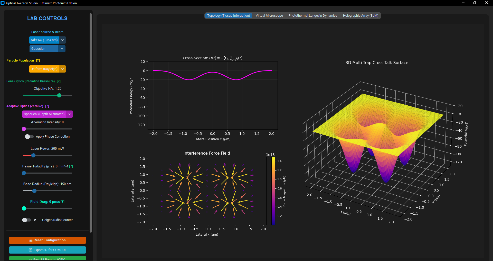
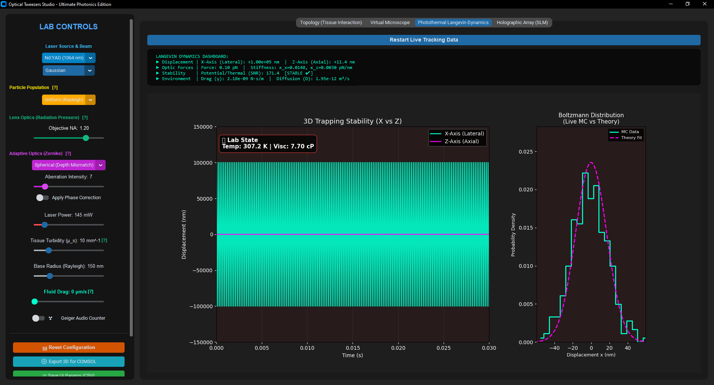
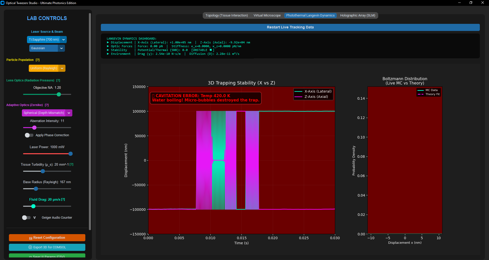

```markdown
# Holographic Optical Tweezers Studio & Photothermal Langevin Dynamics Simulator 🔬


An advanced, high-fidelity numerical simulation framework designed to model, visualize, and analyze complex electromagnetic light-matter interactions within **Holographic Optical Tweezers (HOT)** systems. By coupling vector wave propagation algorithms with thermodynamic stochastic differential equations, this studio provides an immersive, real-time environment for computational biophotonics research.

---

## 📸 Simulation Previews & Visual Evidence

> **SEO & Discovery Optimization Note:** High-resolution structural captures are mapped directly below to demonstrate the visual fidelity and verification capabilities of the core computational modules.

### Module 1: 3D Force Landscapes & Multi-Trap Crosstalk

*Figure 1: 3D Potential energy landscape mapping and lateral interference vector fields computed for customizable multi-trap arrays.*

### Module 2: Real-Time Thermodynamic Telemetry

*Figure 2: Live stochastic trajectory tracking of trapped micro-particles overlaid with the exact analytical Boltzmann distribution profile.*

### Module 3: Wavefront Aberration & Adaptive Optics Correction

*Figure 3: Spatial Light Modulator (SLM) phase mask generation via the Gerchberg-Saxton algorithm under induced Zernike aberrations.*

### Module 4: Extreme Photothermal Cavitation Limits

*Figure 4: Critical system failure state under high-power laser exposure, illustrating localized fluid boiling and mechanical trapping degradation.*

---

## 🎯 1. Scientific Rationale: Beyond Classical Approximations

Simulating dynamic optical trapping landscapes traditionally requires heavy, non-interactive Finite Element Method (FEM) grid solvers. This framework eliminates hours of pre-computation by solving the underlying physics on the fly, providing **instantaneous, modular feedback** at microsecond resolutions.

Unlike highly idealized mathematical models, this simulator introduces real-world biophysical constraints:
* **Dynamic Local Thermals:** Explicitly couples laser power absorption with fluid property shifts.
* **Tissue Degradation Barriers:** Accounts for macro-attenuation within deep biological layers.
* **Microfluidic Shear Forces:** Tests the structural confinement stiffness under active external flows.

---

## 🗺️ 2. Advanced Interactive Visualization Dashboards

The platform maps complex biophysical data across four cutting-edge graphical dashboards managed via a highly responsive multi-tab `CustomTkinter` architecture:

1. **Topology & Tissue Interaction Layout:** Evaluates the spatial profile of the potential wells alongside a vector map of force fields using tailored wavelength-specific scientific colormaps (e.g., Argon Green, Ti:Sapphire Red).
2. **Virtual Microscope Chamber:** Animates up to 15 independent stochastic micro-particles within a top-down optical viewport under the influence of regular Gaussian or singular Vortex laser profiles.
3. **Photothermal Langevin Dynamics Dashboard:** Streams the time-evolution displacement of trapped specimens at microsecond intervals, plotting lateral vs. axial spatial confinement stability.
4. **Holographic Array Digital Bench:** Renders the target diffraction arrangement, the generated phase map distributed across the SLM pixels, and a dynamic 3D projection of output optical intensity.

---

## 🎛️ 3. Educational Laboratory Controls (Dynamic Physics Knobs)

The application acts as an interactive digital optical bench, allowing users to sweep delicate physics coefficients via real-time sliders to explore edge-case regimes:

* **Laser Source Selector:** Toggles between Nd:YAG, Ti:Sapphire, and Argon Green, automatically updating corresponding medium refractive indexes, material absorption profiles, and thermal absorption coefficients.
* **Numerical Aperture (NA) Regulator:** Modulates the objective lens NA from 0.6 up to 1.4. It dynamically triggers hardware alerts when NA > 1.33, warning the operator that immersion oil media is mathematically required to sustain the trapping gradients.
* **Tissue Turbidity Coefficient:** Simulates deep biological tissue penetration by attenuating local beam intensity via the classical Beer-Lambert relation.
* **Fluid Flow Rate Controller:** Introduces localized microfluidic velocity vectors, allowing users to visually measure the exact threshold where mechanical drag packing overcomes the optical potential barriers.

---

## 🔍 4. Real-Time Telemetry & Numerical Diagnostics Engine

To guarantee scientific transparency, an embedded diagnostics telemetry engine continuously samples positional data streams to output critical laboratory metrics:

* **Trap Stiffness Estimator:** Employs the equipartition theorem, sampling tracking variances to calculate directional trapping stiffness constants in real-time.

$$
\kappa_x = \frac{k_B T}{\sigma_x^2}
$$

* **Viscosity Auto-Scaler:** Computes local photothermal temperature scaling and updates the dynamic fluid viscosity through an empirical decay curve to dynamically adjust the viscous damping coefficient.

$$
T_{local} = T_{ambient} + \Delta T(P_{laser})
$$

* **Signal-to-Noise Ratio (SNR):** Evaluates the trapping confinement parameter against background thermal kinetics. If SNR < 10, the system highlights structural instability, predicting imminent particle escape.

---

## 🔬 5. Mathematical Framework & Core Physics

The physics engine and numerical approximations implemented in this framework are inspired by and validated against the generalized electromagnetic scattering theories developed by **Prof. Gérard Gouesbet**. Specifically, the separation of optical gradient/scattering dynamics and the localized beam shape approximations align with the comprehensive framework presented in Gouesbet's review on the mechanical effects of laser light.

### A. Optical Force Mechanics
Particles are modeled under the dipole approximation within the Rayleigh scattering regime. Following the foundations of **Generalized Lorenz-Mie Theory (GLMT)**, the core engine splits the electromagnetic trapping mechanics into two fundamental component vectors:

* **Gradient Force:** Pulls the dielectric specimen toward the highest intensity focal point, scaled by the Clausius-Mossotti polarizability:

$$
\mathbf{F}_{grad} = \frac{1}{2} \alpha \nabla \langle E^2 \rangle = \frac{2 \pi n_m a^3}{c} \left( \frac{m^2 - 1}{m^2 + 2} \right) \nabla I(\mathbf{r})
$$

* **Scattering Force:** Pushes the particle along the beam propagation vector via radiation pressure momentum transfer:

$$
\mathbf{F}_{scat} = \frac{I(\mathbf{r}) \sigma_{scat} n_m}{c} \hat{\mathbf{z}}
$$

Where the scattering cross-section is defined as:

$$
\sigma_{scat} = \frac{8\pi^3}{3} \frac{a^6}{\lambda^4} \left( \frac{m^2 - 1}{m^2 + 2} \right)^2
$$

### B. Tissue Turbidity Attenuation
Deep-tissue light propagation introduces scattering losses. The local laser intensity distribution is modulated by coupling a 3D beam waist propagation function with the classical Beer-Lambert relation:

$$
I(r, z) = I_0 \left( \frac{w_0}{w(z)} \right)^2 \exp\left( -\frac{2r^2}{w(z)^2} \right) \cdot \exp(-\mu_s |z|)
$$

### C. Stochastic Photothermal Langevin Dynamics
Micro-particle trajectories within the fluid cell are governed by the over-damped Langevin stochastic differential equation integrated via a second-order Monte Carlo scheme:

$$
\Delta x = \frac{\mathbf{F}_{grad, x} + \mathbf{F}_{drag, x}}{\gamma} \Delta t + \sqrt{2 D \Delta t} \cdot \mathcal{W}(t)
$$

Where spatial damping and the thermal diffusion coefficient obey strict Einstein-Stokes relations:

$$
\gamma = 6 \pi \eta(T_{local}) a
$$

$$
D = \frac{k_B T_{local}}{\gamma}
$$

### D. Wavefront Aberrations via Zernike Polynomials
Optical distortions caused by depth mismatches or misaligned components are mathematically decomposed into orthogonal Zernike phase distributions across the circular aperture:

$$
\Phi(\rho, \theta) = \sum C_i Z_n^m(\rho, \theta)
$$

* Spherical Aberration ($Z_4^0$):
$$
\sqrt{5}(6\rho^4 - 6\rho^2 + 1)
$$
* Astigmatism ($Z_2^2$):
$$
\sqrt{6}\rho^2 \cos(2\theta)
$$
* Coma ($Z_3^1$):
$$
\sqrt{8}(3\rho^3 - 2\rho)\cos(\theta)
$$

Phase optimization and multi-trap structural configurations are resolved iteratively using the Gerchberg-Saxton Fourier transform loop constraint:

$$
A_{focal} e^{i\phi_{focal}} = \mathcal{F} \left\{ A_{slm} e^{i\phi_{slm}} \right{} \}
$$

---

## 📐 6. Spatial Frequency & Interference Fringe Analysis

When multi-trap holographic arrays are projected onto the focal plane, close-proximity optical fields overlap, creating complex spatial interference fringes:
* **Line Cut Profiler:** The *Topology View* automatically maps a 1D spatial intensity slice cut across the exact mid-plane of the trapping network. This lets researchers measure the precise potential energy barrier height separating adjacent traps.
* **Fringe Geometry:** By analyzing the peak-to-peak distance of these multi-trap patterns, the system illustrates how phase modulation limits or enhances local trapping confinement, showing where field cross-talk could disrupt spatial stability.

---

## 🌊 7. Wavefront Geometry: Converging Gradients and Diverging Scattering Fields

The simulator accurately maps the geometric wave transformations necessary to form a stable 3D optical gradient trap:
* **Converging Wavefronts:** High-angle convergence vectors are calculated based on the objective's Numerical Aperture. Planar wavefronts hitting the pupil are warped into highly focused spherical waves, generating intense spatial intensity gradients required to pull particles inward.
* **Diverging Wavefronts:** Past the exact focal plane, the wave front rapidly diverges. The simulator tracks how the scattering force can dominate the axial gradient pull if the lens NA is too low, physically driving larger specimens along the optical axis instead of capturing them.

---

## 🔀 8. Comparative Hydrodynamic Analysis (Rayleigh vs. Mie Cross-Talk)

To analyze sample heterogeneity, the *Virtual Microscope* introduces an active **A/B Comparison Layout**:
* **Rayleigh Regime (Mode A):** Models small dielectric structures where gradient forces dominate, locking the particle tightly within the beam focal core.
* **Mie Regime Component (Mode B):** Injects large cellular structures into the same environment. Users can directly witness Mode B specimens being blown out of the trap by dominant radiation scattering forces while Rayleigh structures remain trapped.

---

## 💾 9. Computational Reproducibility & Multi-Software Interoperability

* **CSV Parametric Logging:** Instantly exports all current slider metrics, environmental viscosities, calculated stiffness tensors, and laser settings into a cleanly organized spreadsheet.
* **COMSOL Multiphysics 3D Data Export:** Outputs a structured 3D matrix grid containing exact coordinate data and local field intensities. This text file is natively formatted to be pulled directly into **COMSOL** as an analytical interpolation function for finite element electromagnetic validation.

---

## 🚀 10. Deployment, Dependencies & Local Execution

### A. Clone the Repository
```bash
git clone [https://github.com/MehrdadKalhori/Holographic-Optical-Tweezers-Simulator.git](https://github.com/MehrdadKalhori/Holographic-Optical-Tweezers-Simulator.git)
cd Holographic-Optical-Tweezers-Simulator

```

### B. Install Dependencies

```bash
pip install -r requirements.txt

```

*(Where `requirements.txt` contains exactly: `numpy`, `matplotlib`, `customtkinter`)*

### C. Launch the App

```bash
python main.py

```

---

## 📂 Repository Architecture

```text
├── assets/                 # High-resolution UI screenshots for SEO referencing
├── physics_engine.py       # Core numerical modules (gradient fields, SDE Langevin integrators)
├── gui_main.py             # CustomTkinter layout and real-time Matplotlib rendering loops
├── main.py                 # Structured single entry point to launch the studio application
└── requirements.txt        # Third-party dependency registry

```

---

## 📚 Theoretical Foundations & References

* **Gouesbet, G. (2019).** *Generalized Lorenz–Mie theories and mechanical effects of laser light, on the occasion of Arthur Ashkin's receipt of the 2018 Nobel prize in physics for his pioneering work in optical levitation and manipulation: a review.* Journal of Quantitative Spectroscopy and Radiative Transfer, 236, 106584.
[DOI: 10.1016/j.jqsrt.2019.106584](https://www.google.com/search?q=https://doi.org/10.1016/j.jqsrt.2019.106584)
* **Gouesbet, G., & Gréhan, G. (2017).** *Generalized Lorenz-Mie Theories.* Springer International Publishing.
[DOI: 10.1007/978-3-319-50299-1](https://www.google.com/search?q=https://doi.org/10.1007/978-3-319-50299-1)

---

Crafted by **Mehrdad Y. Kalhori**, straight out of the Wild West of Lorestan, Iran 🤠

*For academic inquiries, research collaborations, or PhD recruitment opportunities, please reach out via [LinkedIn](https://www.google.com/search?q=https://www.linkedin.com/in/mehrdad-kalhori-400a3234a).*

```

```
